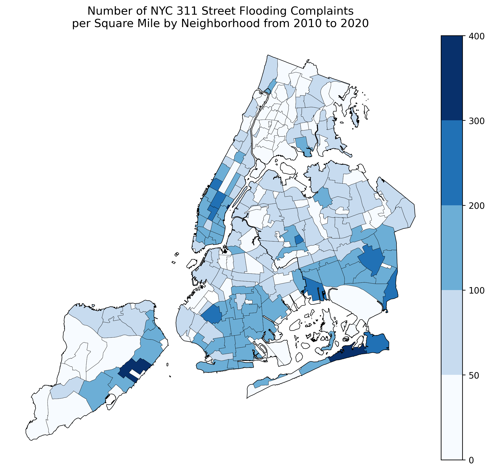

# Analyzing NYC's 311 Street Flooding Complaints from 2010 to 2020  
Mark Bauer  

 

# Table of Contents

   * [Executive Summary](#Executive-Summary)
   * [Introduction](#Introduction)
   * [Getting Started](#Getting-Started)
       * [Prerequisites](#Prerequisites)
           * [Data Science Tools: Anaconda](#Data-Science-Tools-Anaconda)
               * [Included Python Libraries](#Included-Python-Libraries)
               * [Additional Libraries](#Additional-Libraries)     
       * [Notebooks](#Notebooks)
       * [Data](#Data)     
   * [Resources](#Resources)
   * [Media](#Media)
   * [Further Reading](#Further-Reading)
   * [Say Hello!](#Say-Hello)

# Executive Summary

In progress...

# Introduction

Flooding poses a serious threat to coastal cities all around the world, and New York City is no exception. Hurricane Sandy in 2012 devastated the area, with many communities still suffering from its effects or unable to fully recover.  What can citizen science data tell us about where flooding occurs and how it is changing over time? Additionally, how can this data potentially play a role in how New York City prepares and ultimately mitigates flooding in the future?  

In this project, I explored NYC's 311 street flooding complaints data. Specifically, I attempted to answer the following questions:
1. The distribution of street flooding complaints throughout the five boroughs  
2. How street flooding complaints are changing over time  
3. The average and median response hours to 311 street flooding complaints  
3. Case studies from Midland Beach, Staten Island and Arverne, Queens

# Notebooks

You can view these notebooks through your browser by clicking *View* under the *Static Webpage* column.  

| File Name | Description | Static Webpage |
| :-------- | :---------- | :------------- |
| [analysis_mapping.ipynb](https://github.com/mebauer/nyc-311-street-flooding/blob/main/analysis_mapping.ipynb) | Analyzing street flooding complaints by location. | [View](https://nbviewer.jupyter.org/github/mebauer/nyc-311-street-flooding/blob/main/analysis_mapping.ipynb) |
| [analysis_timeseries.ipynb](https://github.com/mebauer/nyc-311-street-flooding/blob/main/analysis_timeseries.ipynb) | Analyzing street flooding complaints through time. | [View](https://nbviewer.jupyter.org/github/mebauer/nyc-311-street-flooding/blob/main/analysis_timeseries.ipynb) |
| [analysis_streets_and_case_studies.ipynb](https://github.com/mebauer/nyc-311-street-flooding/blob/main/analysis_streets_and_case_studies.ipynb) | Analyzing street flooding complaints by street and case studies from Arverne and Midland Beachs. | [View](https://nbviewer.jupyter.org/github/mebauer/nyc-311-street-flooding/blob/main/analysis_streets_and_case_studies.ipynb) |

# Getting Started

## Prerequisites

- Basics of Python or other  programming languages (R, SQL, etc.)
- Knowledge of Data Analysis
- Basics of Jupyter Notebooks

This proejct recommends beginner-level proficiency with Python and is focused on applying Python to data analysis.

### Data Science Tools: Anaconda

Download and install [Anaconda](https://www.anaconda.com/products/individual) python distribution.

#### Included Python Libraries

- pandas
- matplotlib
- seaborn

#### Additional Libraries

I am using a Mac, but if you're using Windows, you may need to install these packages:

- geopandas

`conda install -c conda-forge geopandas`

- geoplot

`conda install -c conda-forge geoplot`

- fiona

`conda install -c conda-forge fiona`

- pywin32

`conda install -c anaconda pywin32`

- jupyter_contrib_nbextensions

`conda install -c conda-forge jupyter_contrib_nbextensions`

`jupyter contrib nbextension install --user`

- watermark

`conda install -c conda-forge watermark`

## Data 

| Dataset | Description |
| :-------- | :---------- |
| [311 Street Flooding Complaints](https://data.cityofnewyork.us/Social-Services/311-Service-Requests-from-2010-to-Present/erm2-nwe9) | All 311 Service Requests from 2010 to present. |
| [Streets](https://data.cityofnewyork.us/City-Government/NYC-Street-Centerline-CSCL-/exjm-f27b) | The NYC Street Centerline (CSCL) is a road-bed representation of New York City streets containing address ranges and other information such as traffic directions, road types, segment types. |
| [Neighborhood Tabulation Areas](https://data.cityofnewyork.us/City-Government/Neighborhood-Tabulation-Areas-NTA-/cpf4-rkhq) | GIS data: Boundaries of Neighborhood Tabulation Areas as created by the NYC Department of City Planning using whole census tracts from the 2010 Census as building blocks. These aggregations of census tracts are subsets of New York City's 55 Public Use Microdata Areas (PUMAs). |
| [Boroughs]() | GIS data of NYC boroughs. |

Data dictionaries for the data sets above can be found in the [data-dictionaries](https://github.com/mebauer/nyc-311-street-flooding/tree/main/data-dictionaries) folder. 

# Resources

- [NYC Open Data](https://opendata.cityofnewyork.us/)

- [About NYC 311](https://portal.311.nyc.gov/about-nyc-311/)

- [311 Service Requests from 2010 to Present Webpage](https://data.cityofnewyork.us/Social-Services/311-Service-Requests-from-2010-to-Present/erm2-nwe9)

- [Report Street Flooding to NYC 311](https://portal.311.nyc.gov/article/?kanumber=KA-02198)

# Media

- [NYC DOT Facebook post](https://www.facebook.com/NYCDOT/posts/if-you-see-ponding-or-flooding-on-any-nyc-street-or-highway-report-it-to-nyc-311/10156270397437887/) about NYC 311 Street Flooding.

- [NYC 311 Twitter post](https://twitter.com/nyc311/status/1067131135749165056) about NYC 311 Street Flooding.

# Further Reading

Inspiration for the project came from an article by [Localize.city](https://www.localize.city/) titled, "[Puddles or Small Ponds? Where New Yorkers Feel Most Deluged by Street Flooding](https://www.localize.city/blog/puddles-or-small-ponds-where-new-yorkers-feel-most-deluged-by-street-flooding/)."

# Say Hello!   

I can be reached at:  

[Twitter](https://twitter.com/markbauerwater)  
[LinkedIn](https://www.linkedin.com/in/markebauer/)
[GitHub](https://github.com/mebauer)