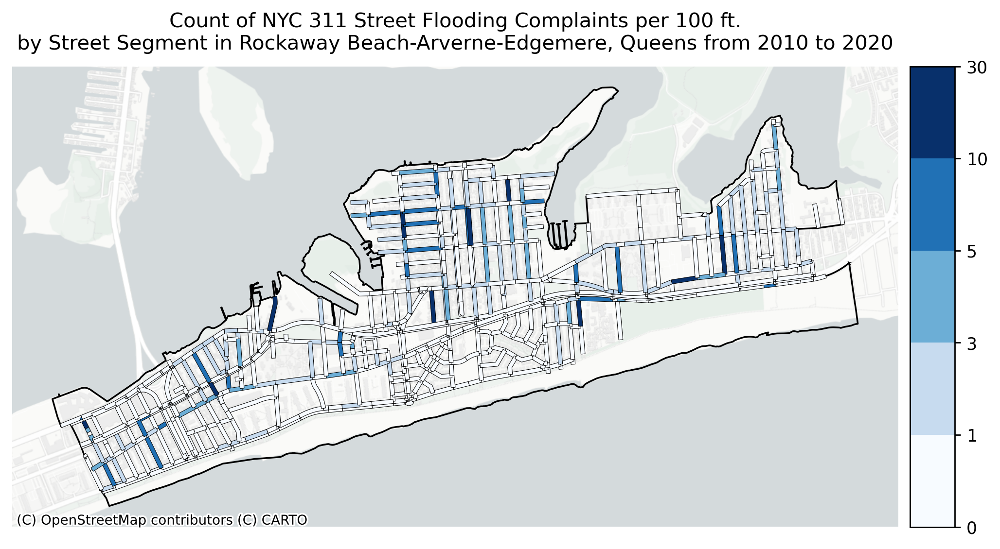

# Analyzing NYC's 311 Street Flooding Complaints from 2010 to Present  
Mark Bauer  

# Executive Summary

# Introduction

I conducted an analysis of Street Flooding Complaints with NYC Open Data's 311 data set. 

# Getting Started

## Prerequisites

### Data Science Tools: Anaconda

Download and install [Anaconda](https://www.anaconda.com/products/individual) python distribution.

#### Included Python Libraries

- pandas
- matplotlib
- seaborn

#### Additional Python Libraries

I am using a Mac, but if you're using Windows, you may need to install these packages:

- gseopandas

`conda install -c conda-forge geopandas`

- geoplot

`conda install -c conda-forge geoplot`

- fiona

`conda install -c conda-forge fiona`

- pywin32

`conda install -c anaconda pywin32`

- jupyter_contrib_nbextensions`

`conda install -c conda-forge jupyter_contrib_nbextensions`

`jupyter contrib nbextension install --user`

- watermark

`conda install -c conda-forge watermark`

## Notebooks

| File Name | Description |
| :-------- | :---------- |
| [311-street-flooding-complaints.ipynb](analysis-nyc-311-street-flooding.ipynb) | Analysis of citywide street flooding complaints in the 311 data set. Analysis includes maps, timeseries, bar plots and other types of visualizations. |
| [assign-complaints-to-streets.ipynb](analysis-assign-complaints-to-streets.ipynb) | Analysis for assigning 311 street flooding complaints to streets. Also includes data visualizations about which streets have the most street flooding complaints, as well as case studies for Midland Beach, Staten Island and Arverne, Queens. |
| [data-wrangling-311-data.ipynb](/data-wrangling/data-wrangling-311-data.ipynb) | Data wrangling for exporting the 311 data using Socrata's API. Note: I signed up for an API key. |
| [data-wrangling-streets-data.ipynb](/data-wrangling/data-wrangling-streets-data.ipynb) | Data wrangling for clipping and extracting NYC streets. |

## Data 

| Data Set | Description |
| :-------- | :---------- |
| [311 Street Flooding Complaints](https://github.com/mebauer/nyc-311-street-flooding/blob/main/data-raw/raw-street-flooding-data.csv) | Raw data for all 311 Service Requests from 2010 to present where descriptor == Street Flooding. |
| [Streets](https://github.com/mebauer/nyc-311-street-flooding/blob/main/data-raw/raw-streets-clipped.json) | Raw data of the NYC Street Centerline (CSCL) data set where street centerline roadway type == Street. |
| [Neighborhood Tabulation Areas]() | Raw data for NYC Neighborhood Tabulation Areas (NTA). |
| [Boroughs]() | Raw data of NYC boroughs. |

Data dictionaries for the data sets above can be found in the [data-dictionaries](https://github.com/mebauer/nyc-311-street-flooding/tree/main/data-dictionaries) folder. 

# Further Reading

Inspiration for the project came from an article by [Localize.city](https://www.localize.city/) titled, "[Puddles or Small Ponds? Where New Yorkers Feel Most Deluged by Street Flooding](https://www.localize.city/blog/puddles-or-small-ponds-where-new-yorkers-feel-most-deluged-by-street-flooding/)."

# Say Hello!   

I can be reached at:  

[Twitter](https://twitter.com/markbauerwater)  
[LinkedIn](https://www.linkedin.com/in/markebauer/)