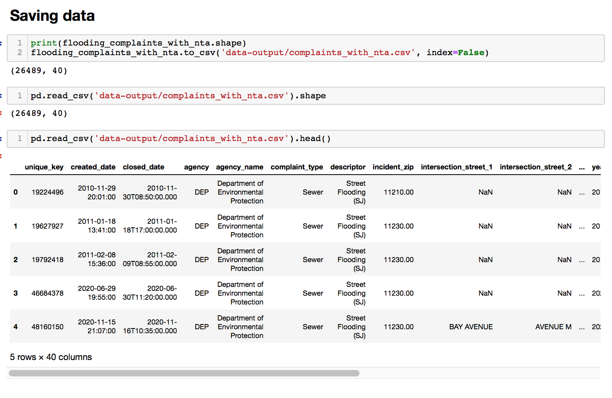
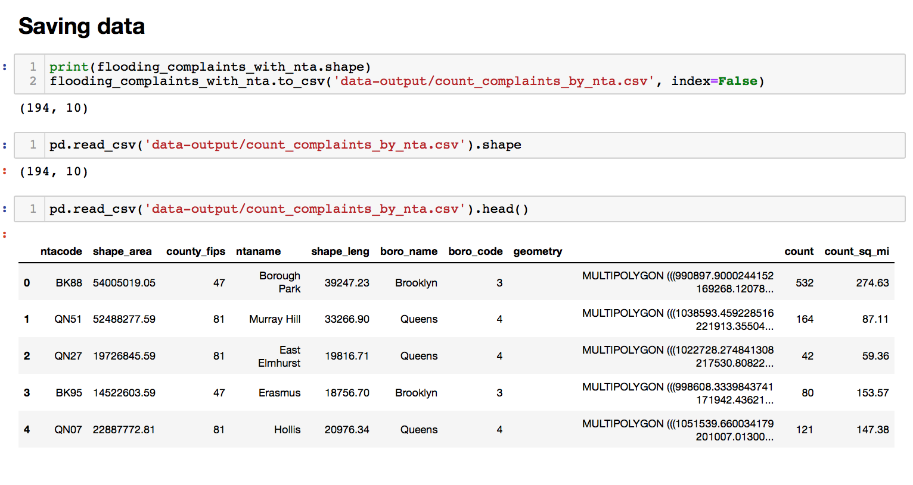
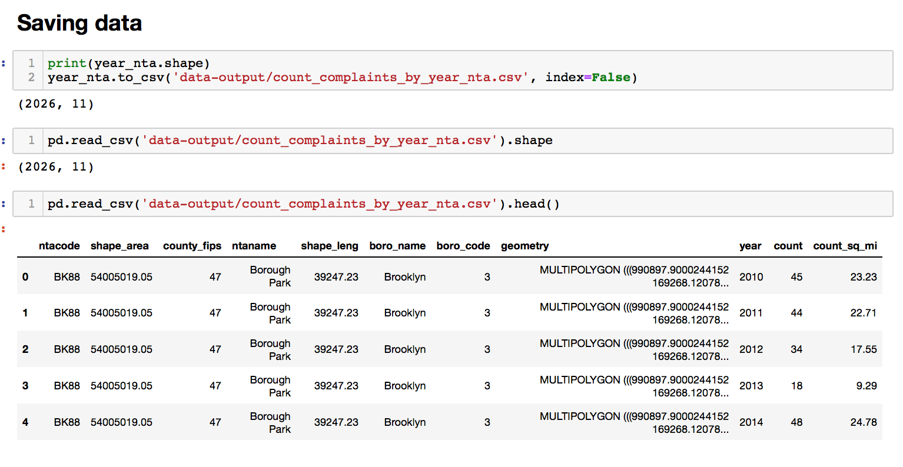
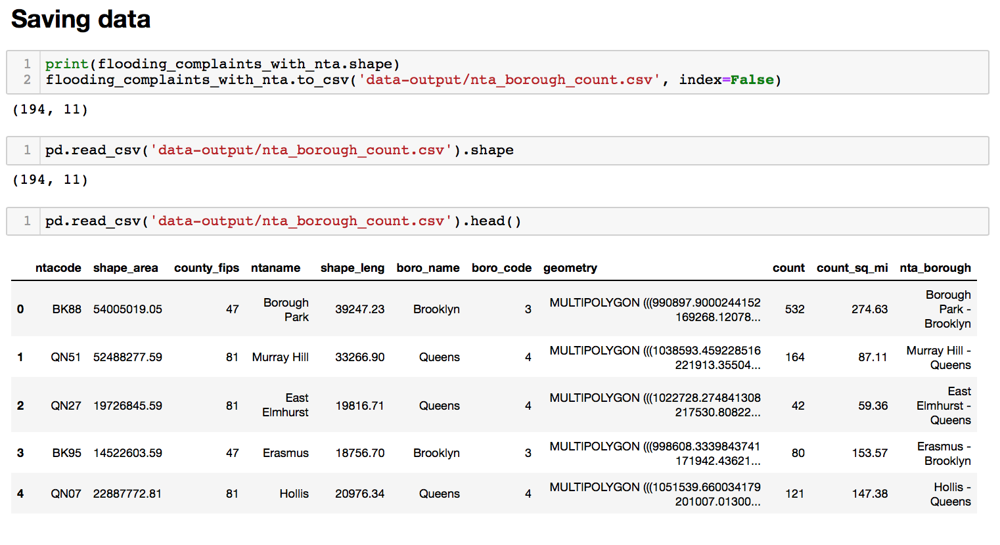
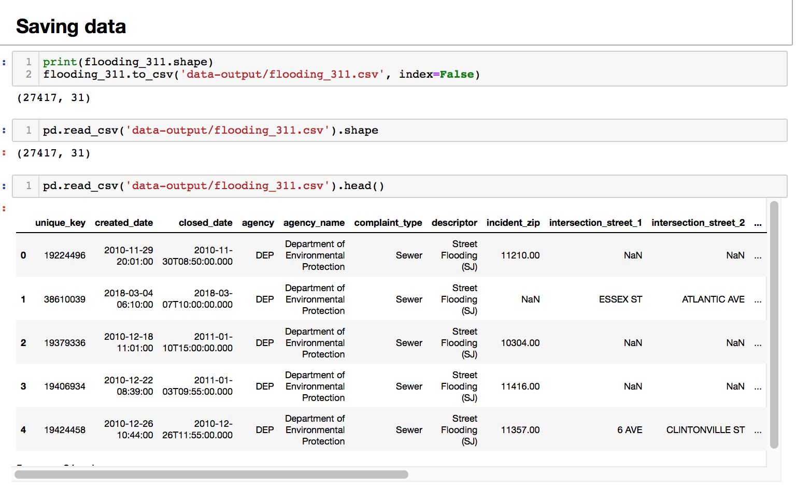
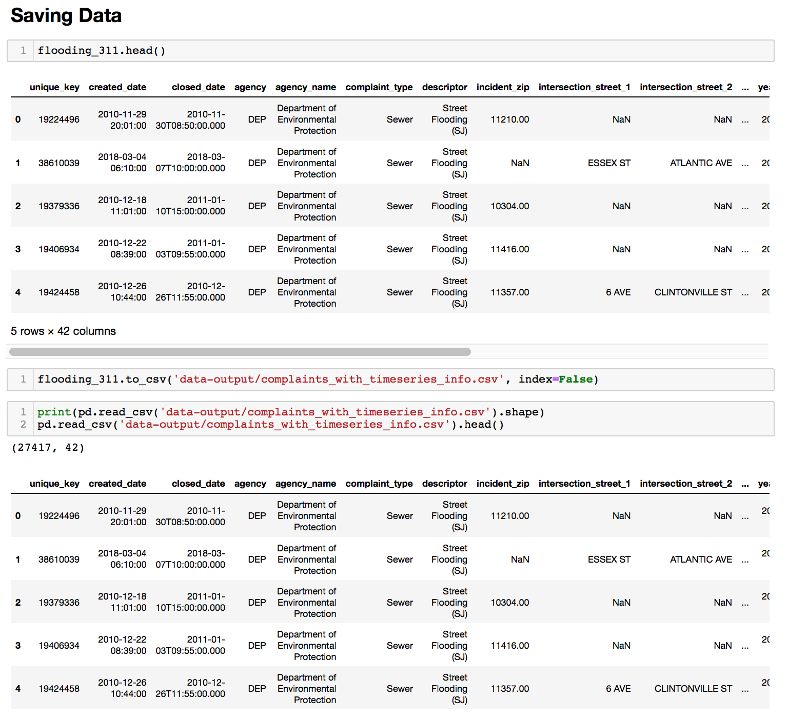
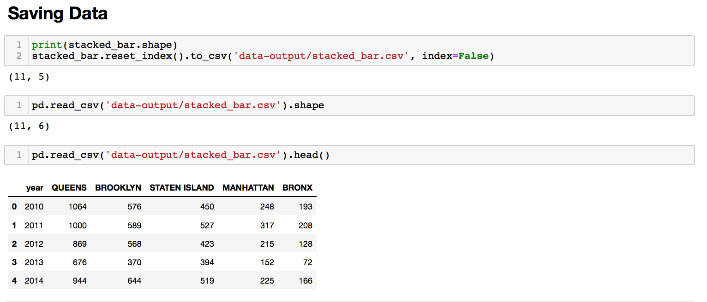
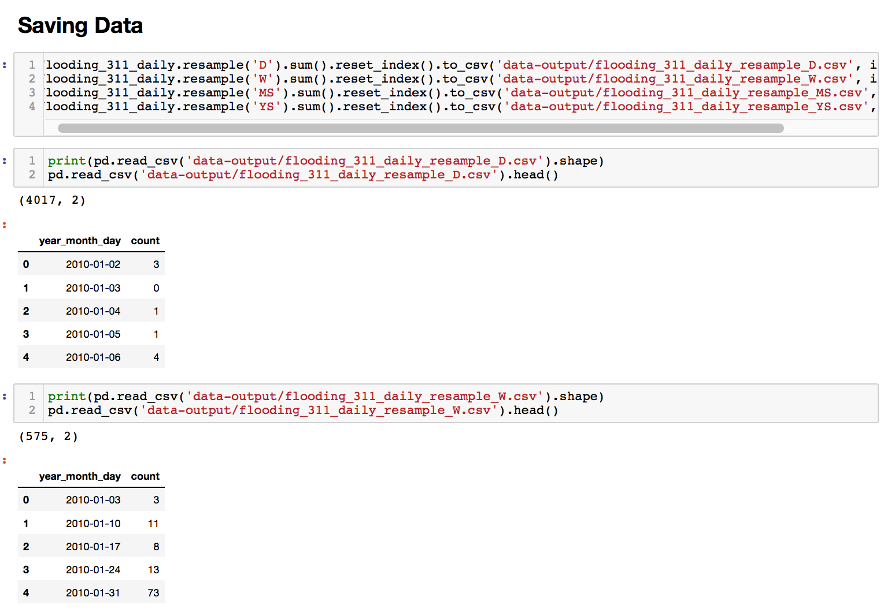

# Output Data

## Mapping Analysis

### complaints_with_nta.csv
 

### count_complaints_by_nta.csv
 

### count_complaints_by_year_nta.csv
 

### nta_borough_count.csv
 

### complaints_timedelta_by_nta.csv
 

## Timeseries Analysis

### flooding_311.csv
 

### complaints_with_timeseries_info.csv
  

### stacked_bar.csv
 

### flooding_311_daily_resample_D.csv
### flooding_311_daily_resample_W.csv
### flooding_311_daily_resample_MS.csv
### flooding_311_daily_resample_YS.csv
 

